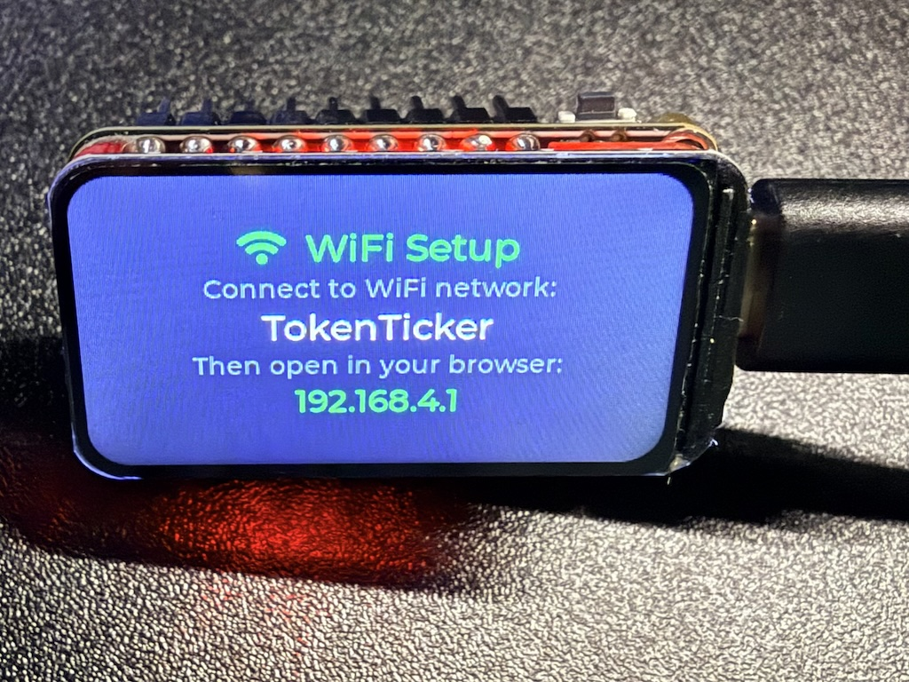
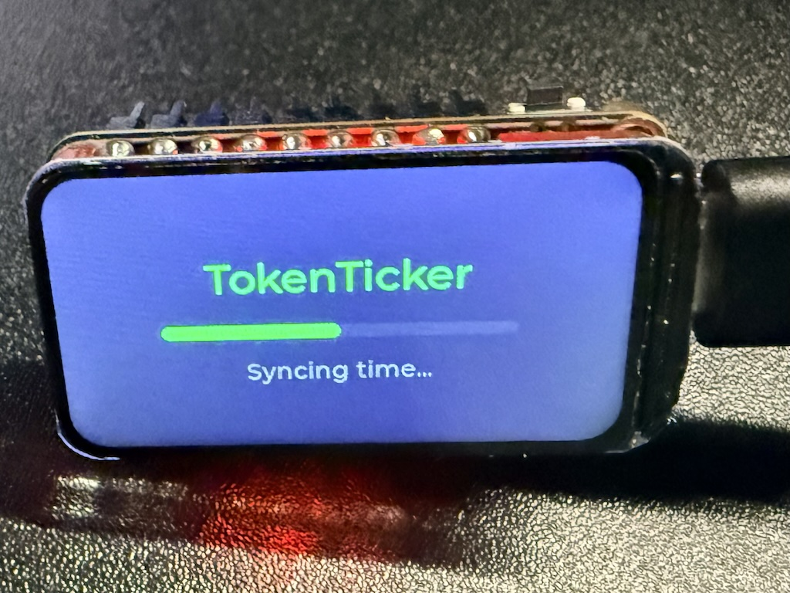
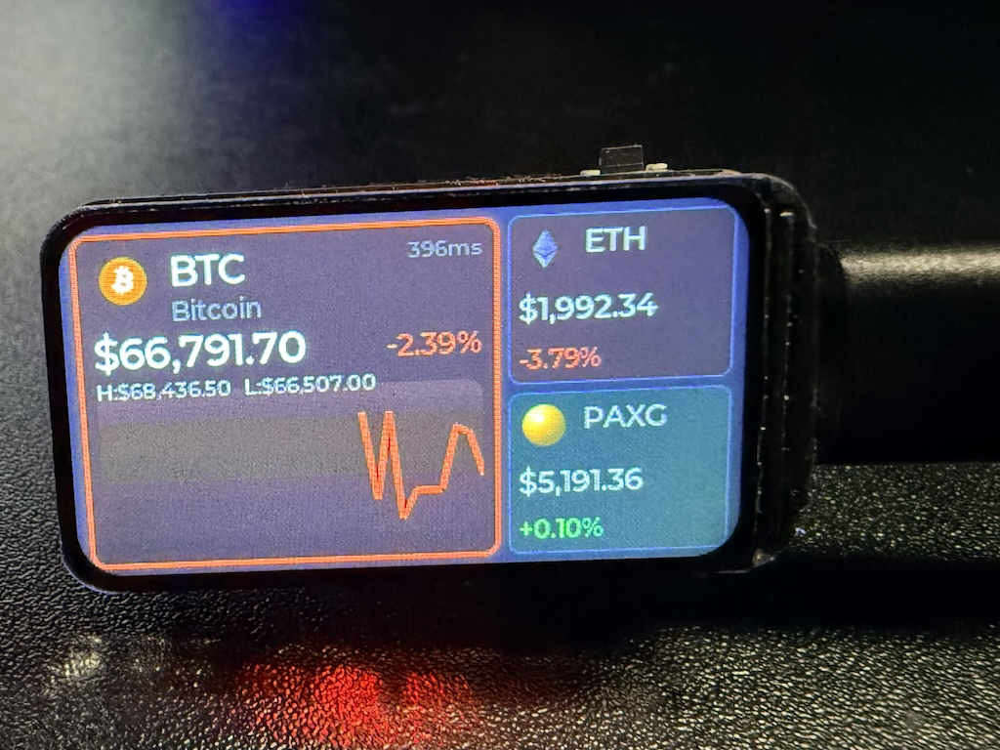
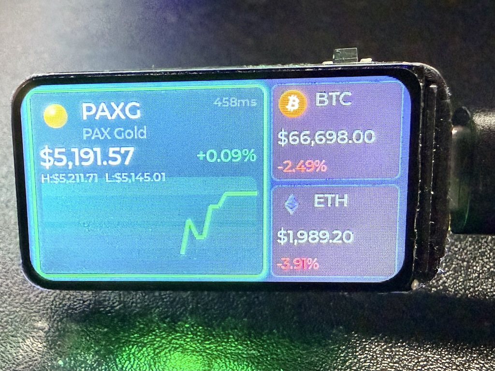
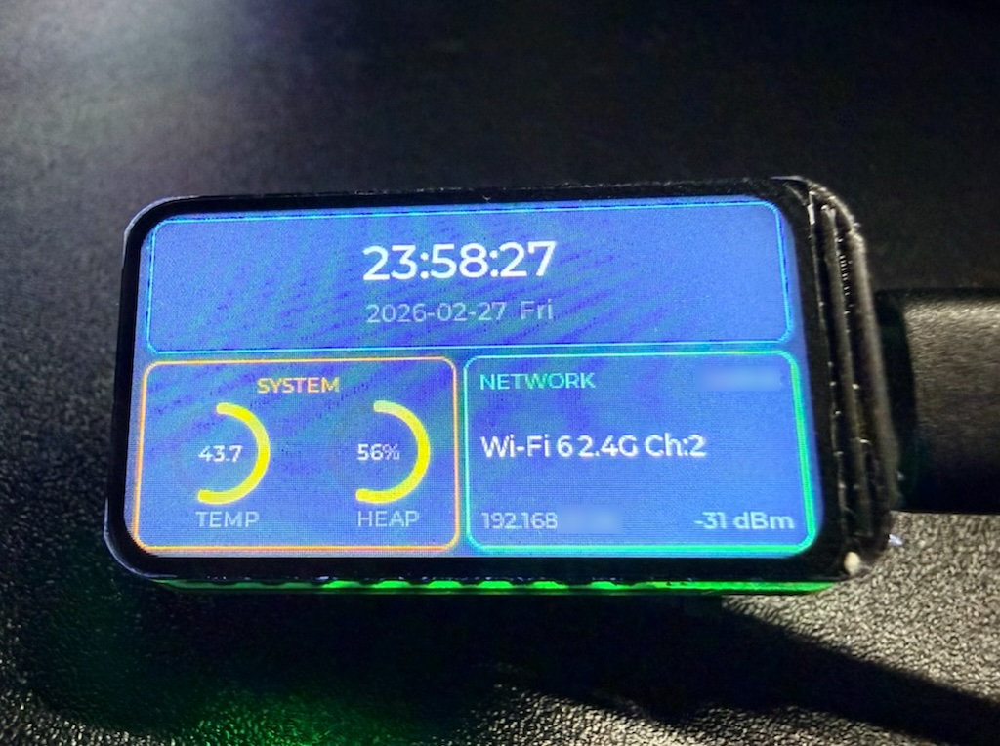

# TokenTicker

[](https://docs.espressif.com/projects/esp-idf/)
[](https://www.waveshare.com/esp32-c6-lcd-1.47.htm)
[](LICENSE)
[](https://lvgl.io/)

[English](README.md)

基于 ESP32-C6 的开源加密货币桌面伴侣。HTTP 实时价格轮询、24h K 线走势图、市场情绪呼吸灯、Apple HomeKit 智能家居联动、手机配网 — 1.47 寸 LCD，7x24 小时常亮运行。

当前支持通过 Gate.io 追踪 **BTC**、**ETH**、**PAXG** 和 **SUI**。设备同时作为 Apple HomeKit 无状态可编程开关，价格暴涨暴跌可直接触发家庭自动化场景。







## 功能特性

- **实时价格** — 4 币种 HTTP 轮询 (10s)，价格滚动动画 + 48 点 24h K 线走势图（30 分钟间隔）
- **市场情绪呼吸灯** — WS2812B 涨绿跌红呼吸灯（3.2s 周期），价格变动时高亮闪烁
- **Apple HomeKit** — 注册为无状态可编程开关；主币种 24h 涨幅 ≥+5% 触发单击事件，跌幅 ≤-5% 触发双击事件，可驱动家庭自动化
- **系统信息面板** — 芯片温度弧形图、堆内存弧形图、Wi-Fi 信号强度柱状图、HomeKit 配对状态、时钟（双击切换）
- **SoftAP 配网** — 无需硬编码 Wi-Fi 凭据，手机连接热点自动弹出配网页面
- **时区配置** — 配网时自动读取浏览器时区，保存到 NVS

## 硬件

| 组件 | 规格 |
|------|------|
| 开发板 | [Waveshare ESP32-C6-LCD-1.47](https://www.waveshare.com/esp32-c6-lcd-1.47.htm)（淘宝/拼多多搜索 `ESP32-C6-LCD-1.47`） |
| MCU | ESP32-C6 |
| 显示屏 | 1.47 寸 ST7789 LCD, 320x172, SPI @ 80 MHz |
| LED | WS2812B RGB (1 颗) |
| 按钮 | BOOT 按钮 (GPIO9, 低电平有效) |

### GPIO 引脚

| GPIO | 功能 |
|------|------|
| 6 | SPI MOSI |
| 7 | SPI CLK |
| 14 | LCD CS |
| 15 | LCD DC |
| 21 | LCD RST |
| 22 | LCD 背光 (PWM) |
| 8 | WS2812B LED |
| 9 | BOOT 按钮 |
| 4 | SD 卡 CS (拉高禁用) |

## 按钮操作

| 操作 | 价格界面 | 信息面板 |
|------|----------|----------|
| 单击 | 切换下一个币种 (BTC → ETH → PAXG → SUI) | 发送 HomeKit 单击事件 |
| 双击 | 切换信息面板 | 切换信息面板 |
| 长按 (3 秒) | 重置 HomeKit + 进入 Wi-Fi 配网 | 重置 HomeKit + 进入 Wi-Fi 配网 |

## Wi-Fi 配网

首次开机（或长按 BOOT 键 3 秒）：

1. 设备创建开放热点：**TokenTicker**
2. 手机连接后自动弹出 Captive Portal 配网页面
3. 从扫描列表中选择目标 Wi-Fi 网络
4. 输入密码并选择时区
5. 设备保存到 NVS 并自动重启

凭据和时区断电不丢失，无需重新编译烧录。

## Apple HomeKit

设备注册为 Apple Home 中的**无状态可编程开关**：

- **配对码** — 根据设备 MAC 地址自动生成，在信息面板底部显示
- **配对方式** — 打开 Apple 家庭 → 添加配件 → 输入屏幕上显示的配对码
- **价格预警** — 主币种 24h 涨幅 ≥+5% 发送单击事件，跌幅 ≤-5% 发送双击事件
- **自动化** — 利用这些事件触发家庭场景（需要家庭中枢：HomePod、Apple TV 或 iPad）

> 这行情，在家开灯都觉得是在烧钱。所以接了 HomeKit — BTC 暴跌自动关灯省电，每一度都不能浪费。🐶

长按重置会同时清除 Wi-Fi 凭据和 HomeKit 配对数据。

## 界面布局

### 价格界面（默认）

```
┌──────────────────────────────────────────┐
│ ┌─────────────────────┐ ┌──────────────┐ │
│ │  BTC  Bitcoin       │ │  ETH         │ │
│ │  $68,432.10         │ │  $3,841.20   │ │
│ │  +2.34%             │ │  -0.82%      │ │
│ │  H: $69,100         │ ├──────────────┤ │
│ │  L: $67,200         │ │  SUI         │ │
│ │  ▁▂▃▄▅▆▇█▇▆▅▄▃▂▁▂▃ │ │  $1.23       │ │
│ └─────────────────────┘ └──────────────┘ │
└──────────────────────────────────────────┘
  主卡片                    侧边卡片 (滚动)
```

### 信息面板（双击）

```
┌──────────────────────────────────────────┐
│ ┌──────────────────────────────────────┐ │
│ │              14:32:07                │ │
│ └──────────────────────────────────────┘ │
│ ┌────────────────┐ ┌──────────────────┐ │
│ │    SYSTEM       │ │ NETWORK   MyWiFi│ │
│ │  ╭──╮   ╭──╮   │ │ Wi-Fi 6 2.4G    │ │
│ │  │38│   │22│   │ │ ▐▐▐▐ -52 dBm    │ │
│ │  ╰──╯   ╰──╯   │ │                 │ │
│ │  TEMP   HEAP    │ │ SETUP 123-45-678│ │
│ └────────────────┘ └──────────────────┘ │
└──────────────────────────────────────────┘
```

## 快速开始（预编译固件）

无需搭建开发环境，浏览器直接刷入：

1. 从 [Releases](https://github.com/f0rmatting/esp32-token-ticker/releases) 下载最新固件
2. 用 USB-C 连接开发板
3. 用 Chrome/Edge 打开 [ESP Web Flasher](https://espressif.github.io/esptool-js/)
4. 点击 **Connect**，选择串口
5. 按以下地址添加固件文件：

| 地址 | 文件 |
|------|------|
| `0x0` | `bootloader.bin` |
| `0x8000` | `partition-table.bin` |
| `0x10000` | `token_ticker.bin` |

6. 点击 **Program**，等待完成
7. 首次开机自动进入 Wi-Fi 配网模式

## 从源码编译

### 前置条件

- [ESP-IDF](https://docs.espressif.com/projects/esp-idf/zh_CN/stable/esp32c6/get-started/) v5.x
- 一块 Waveshare ESP32-C6-LCD-1.47 开发板
- USB-C 数据线

```bash
# 克隆仓库（--recursive 拉取 esp-homekit-sdk 子模块）
git clone --recursive https://github.com/f0rmatting/esp32-token-ticker.git
cd esp32-token-ticker

# 编译
idf.py set-target esp32c6
idf.py build

# 烧录并监控
idf.py -p <PORT> flash monitor
```

首次开机会自动进入 Wi-Fi 配网模式。

## 为什么选用 Gate.io？

作为全球领先的头部交易所，Gate.io 提供了一个显著的技术优势：其 API 在中国大陆无需 VPN 即可直连。对于像本项目（基于 ESP32-C6）这样需要 7x24 小时稳定、实时获取行情数据的"全天候在线"嵌入式设备，Gate.io 是主流平台中确保高可用数据采集最务实的选择。

## 项目结构

```
main/
├── token_ticker.c      入口 (app_main)
├── board_config.h      GPIO 引脚定义
├── display.c/h         SPI + ST7789 + LVGL 初始化
├── ui.c                主界面、启动画面、价格卡片
├── ui_info.c           信息面板 (时钟、温度弧形、内存弧形、WiFi、HomeKit)
├── ui_internal.h       UI 模块共享状态和布局常量
├── ui.h                UI 公共接口
├── button.c            按钮处理 (单击/双击/长按)
├── wifi.c/h            Wi-Fi STA 连接 + 自动重连
├── wifi_prov.c/h       SoftAP 配网 + Captive Portal
├── time_sync.c/h       SNTP 时间同步 + NVS 时区
├── price_fetch.c/h     Gate.io HTTP 价格轮询 + K 线历史
├── homekit.c/h         Apple HomeKit (HAP) 无状态可编程开关
├── led.c/h             WS2812B 呼吸灯 + 闪烁效果
└── crypto_logos.c/h    内嵌 Logo 图片数据
components/
└── esp-homekit-sdk/    Espressif HomeKit SDK (git 子模块)
sdkconfig.defaults      编译配置预设
```

## 启动流程

```
app_main()
  ├── power_management_init()   DFS 电源管理
  ├── display_init()            SPI 总线、ST7789 面板、背光、LVGL
  ├── led_init()                WS2812B 呼吸灯
  ├── btn_init()                按钮中断 + 任务（提前初始化，配网长按可用）
  ├── wifi_init_sta()           连接 (NVS 凭据) 或配网 (SoftAP)
  │   如果连接成功:
  │   ├── time_sync_init()      SNTP 同步 + 从 NVS 读取时区
  │   ├── price_fetch_history() 预加载 24h K 线图数据
  │   ├── price_fetch_first()   同步首次价格拉取（全部 4 币种）
  │   └── homekit_init()        启动 HAP 服务器 + mDNS
  ├── ui_init()                 构建价格卡片 + 信息面板
  └── price_fetch_start()       HTTP 轮询任务 (10s 周期)
```

## 数据流

```
HTTP (10s) ──> price_fetch ──> ui_update_price()
                                  ├── 价格标签 + 图表更新
                                  ├── LED 闪烁
                                  └── check_price_alert()
                                       ├── 涨幅 ≥ +5% → HomeKit 单击事件
                                       └── 跌幅 ≤ -5% → HomeKit 双击事件
```

## NVS 存储

| 命名空间 | 键 | 值 |
|----------|-----|-----|
| wifi_cfg | ssid | Wi-Fi SSID (最长 32 字节) |
| wifi_cfg | pass | Wi-Fi 密码 (最长 64 字节) |
| wifi_cfg | tz | POSIX 时区字符串 (如 `CST-8`) |
| hap_ctrl | — | HomeKit 控制器/配对数据 |
| hap_main | — | HomeKit 配件信息 |

## 依赖

- **ESP-IDF** v5.x (含 FreeRTOS)
- [lvgl/lvgl](https://components.espressif.com/components/lvgl/lvgl) ~9.2
- [espressif/esp_lvgl_port](https://components.espressif.com/components/espressif/esp_lvgl_port) ^2
- [espressif/led_strip](https://components.espressif.com/components/espressif/led_strip) ^2
- [espressif/esp-homekit-sdk](https://github.com/espressif/esp-homekit-sdk) (git 子模块)

## 路线图

- [x] **Apple HomeKit** — 无状态可编程开关 + 价格暴涨暴跌预警
- [ ] **自定义 Token 配置** — 通过配网页面自由添加/删除关注的币种，无需修改代码
- [ ] **稳定币理财看板** — 展示 DeFi 钱包余额、年化收益率和收益明细
- [ ] **3D 打印外壳** — 设计桌面摆件外壳，让它真正成为实用的桌面小物件

## 参与贡献

欢迎贡献代码！可以通过 Issue 反馈问题或提交 Pull Request。

1. Fork 本仓库
2. 创建功能分支 (`git checkout -b feature/my-feature`)
3. 提交更改
4. 推送到分支 (`git push origin feature/my-feature`)
5. 发起 Pull Request

## 致谢

- [Espressif ESP-IDF](https://github.com/espressif/esp-idf) — IoT 开发框架
- [LVGL](https://github.com/lvgl/lvgl) — 嵌入式图形库
- [Waveshare](https://www.waveshare.com/) — 硬件平台
- [Gate.io](https://www.gate.io/) — 加密货币行情数据 API
- [esp-homekit-sdk](https://github.com/espressif/esp-homekit-sdk) — ESP32 Apple HomeKit (HAP) SDK

## 许可证

本项目采用 [CC BY-NC 4.0](https://creativecommons.org/licenses/by-nc/4.0/deed.zh-hans) 许可证 — 允许个人和非商业用途自由使用。未经授权不得用于商业用途。
